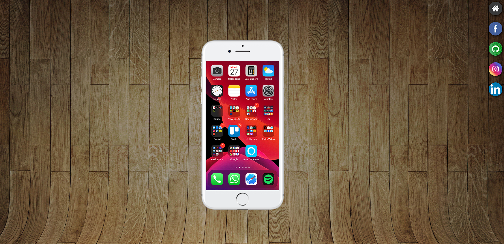
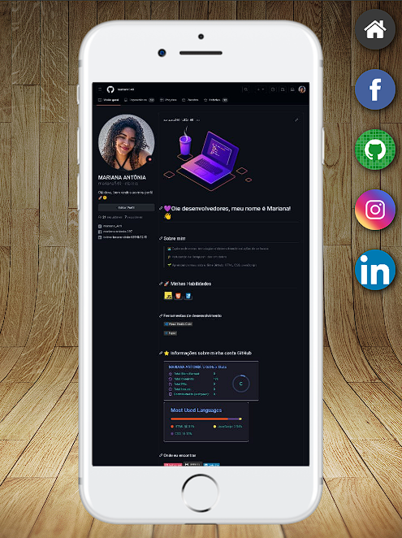

# 🚀 projeto-login

## 🔗 Resultado

O resultado do projeto foi uma página divertida e dinâmica, que mostrava o meu conhecimento e a minha criatividade com HTML e CSS.  
 A página do projeto pode ser acessada no seguinte endereço: [Projeto Redes Sociais](https://mariana549.github.io/projeto-redes-sociais/).

## 📝 Descrição

Este é um projeto que eu fiz como parte do curso de HTML5 e CSS3 do professor Gustavo Guanabara, do [Curso em Vídeo](https://www.cursoemvideo.com). 
 
O objetivo do projeto era criar uma página que simulasse um telefone com ícones das principais redes sociais da atualidade. Ao clicar em um ícone, a página mostrava o site da rede social correspondente em uma janela interna. O projeto usava HTML, CSS e JavaScript para criar a interface e a interação do telefone.

## 💻 Tecnologias

### Neste projeto foi ultilizado:
- HTML: para estruturar o conteúdo da página em elementos como div, img, iframe.
- CSS: para estilizar a página com cores, responsividade, fontes, bordas, margens, alinhamentos e efeitos.

## 😎 veja a captura de tela do projeto a baixo:
- computador

 

- Telefone  

